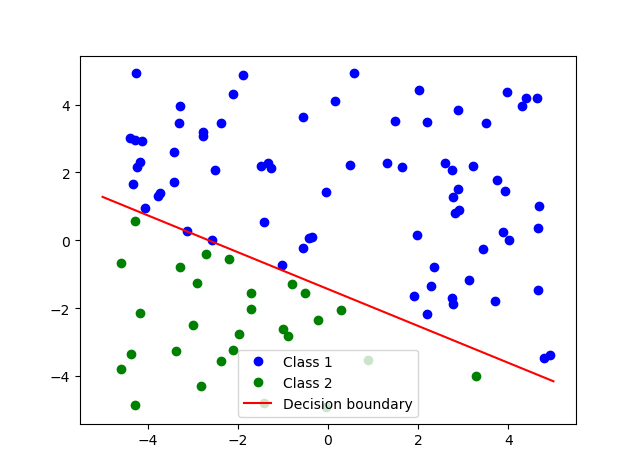

# 统计学习方法Python实现

## 前言

在美国疫情居家隔离两个月，打算把李航老师《统计学习方法》每一章的代码重新实现一遍。

代码主要是基于numpy实现，尽量模仿sklearn的接口，但基本是每个算法最基础的实现。

有时间的话准备进行以下一些完善：

1. 增加对核心算法的注释

2. 根据sklearn完善算法的功能和实现

3. 使用较复杂的测试数据集

## 目录

### 第一章 感知机

代码： [感知机/perceptron.py](./感知机/perceptron.py)

示例：

